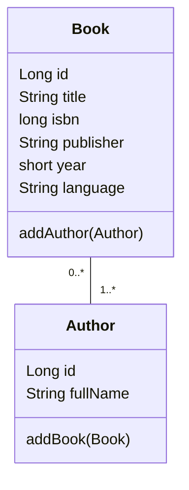
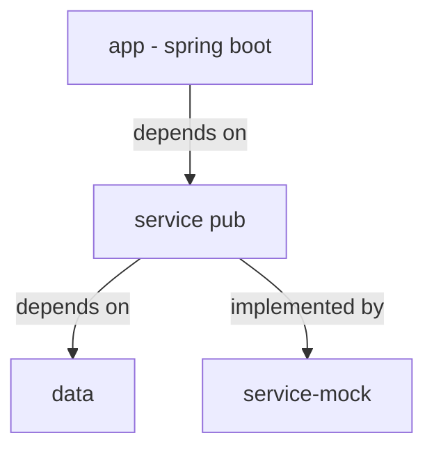

# TP Spring Boot / JPA

Ceci est un TP a destination des L3 MIAGE de l'UGA (IM²AG). 

Il peut être utilisé librement par quiquonque souhaite et sans limitation à condition de citer la source:
https://github.com/bordigoni/l3-tp-spring-boot-jpa

Ce TP nécessite: 
* Java 17
* Maven (optionnel si on utilise le wrapper: `./mvnw`)
* IntelliJ
  * ou un autre éditeur de texte et un outil de visualisation d'OpenAPI permettant d'éditer du code Java
* Postman pour les tests

Pour les étudiants de l'UGA, la VM préconfigurée pourra être utilisé (voir la section "Préparation du projet")

## PARTIE 1: SPRING BOOT

**Lisez tout!!!** sinon vous aurez du mal à rendre le TP

### Présentation

Vous allez implémenter une API gérant une bibliothèque.

Vous aurez en charge de gérer les operations de creation, modification, effacement et lecture/recherche pour:

* Les auteurs
* Les livres

*ATTENTION* la relation entre livres et auteurs est de type many-to-many. 

C'est à dire qu'un livre peut avoir plusieurs auteurs et un auteur peut être l'auteur de plusieurs livres.

### Quelques regles métiers
 
1. On ne peut pas créer de livre sans auteur 
2. On ne peut pas effacer un auteur qui est co-auteur d'un livre
3. Supprimer un auteur provoque la suppression de ses livres

Ces règles métiers sont déjà implémentées dans le module `service-mock`
et sont reflétées dans le contrat d'API en revanche vous devrez gérer les erreurs qui seront levées dans le cas n°2.

### Organisation du projet et architecture

Le projet contient 5 modules:

* `app` : l'application Spring Boot, avec:
  * Controller
  * DTO
  * Mapper DTO <--> Object de domaine
* `service-pub`: les interfaces de services métiers
* `service-mock`: une implémentation simple et en mémoire de service-pub  
* `data`: 
  * le modèle d'objet de domaine
  * les repository JPA (partie 2)
* `service-impl`: utilisable pour la partie 2

Vous ne modifirez que le module app, mais vous aurez besoin de consulter `data` et `service-pub` pour mieux comprendre.

### Preparation du projet

Vous devrez forker ce repository sur votre compte github puis cloner votre fork et pousser les changements au fur et à mesure.

#### VM UGA
Si vous avez un ordinateur personnel et que tout est déjà installé, alors vous pouvez sauté la configuration de la VM. 
Vérifiez que les prérequis présent sur la machine. 

La VM du projet s'apelle: L3_MIAGE_JPA_SPRING accessible sur l'e-cloud (VPN UGA requis)
* Cliquez sur REQUEST
* Choisissez un nom de machine et un mot de passe (gardez-le)
* Une fois la VM crée, dans deployments (10 min d'attente à prévoir)
  * Cliquez sur le chevron '>' à gauche
  * Sur la ligne directement sous le nom de votre VM, cliquez sur '...'
  * Choississez "connect to remote console"
  * Quand le prompt de mot de passe s'affiche: **attention à la langue (dans Ubuntu pas le navigateur)**
  * une fois loggué, les applications sont disponibles dans le carré en bas à gauche

#### Pour tous

Dans tous les cas, je vous conseille de:
  * cloner (`git clone`) votre fork de projet depuis une ligne de commande (le copier collé ne marche pas dans les VM)
  * puis `cd l3-tp-spring-boot-jpa`
  * puis `mvn clean install`
  * importer le projet dans IntelliJ
  * ouvrir un fichier java, et suivez la suggestion d'IntelliJ pour configurer le JDK

### VOTRE TRAVAIL

Vous devrez executer les deux points ci-dessous conjointement pour maximiser vos chances de réussite.

#### Implementation de l'API

En respectant toute la specification OpenAPI v3 [library-openapi.yaml](library-openapi.yaml) vous devrez implémenter toutes les méthodes présente dans `AuthorController` et `BooksController`.

Pour visualier l'OpenAPI, vous pouvez
* Utiliser IntelliJ
* Utiliser [Swagger](https://editor.swagger.com) editor (en ligne)
* Lire le document YAML (pour les personne ne souffrant pas de problèmes de vue ;-) 

Vous devez ajouter : 
* Les annotations Spring pour créer les path d'endpoint
* Les annotations Spring pour gérer les path param, query string, code de retour
* Les annotations pour la validation des DTO [Bean Validation](https://jakarta.ee/specifications/bean-validation/3.0/apidocs/jakarta/validation/constraints/package-summary.html))
* Les appels de service: veuillez consulter la javadoc des classes `AuthorService` `BookService` et aussi `BaseService` toutes les méthodes vous seront utiles.

Vous n'avez **PAS** a implémenter:
* les services
* les DTO
* le mapping DTO <==> objects de domaine
* le endpoints `/api/v1/authors` qui fonctionne déjà et renvoie déjà quelques données.

#### Vérifier le contrat d'API

A l'aide de Postman vous pourrez importer deux resources que vous retrouverez dans l'onglet "Collections" sur la gauche: 

* le fichier [library-openapi.yaml](library-openapi.yaml)
  File -> Import -> OpenAPI ... puis choisissez le fichier
  Vous y retrouverez tous les endpoint classés par path avec des examples de paylaod, utiliser-les pour tester vos endpoints.
* le fichier des tests à executer [L3 Miage Library API Test.postman_collection.json](L3%20Miage%20Library%20API%20Test.postman_collection.json)
  Il contient une série de requêtes, contentant des tests.
  File -> Import -> Upload files... puis choisissez le fichier

Ce dernier vous aidera à choisir l'ordre dans lequel vous pouvez envisager d'implémenter vos endpoint.

#### HOWTO: Comment lancer les tests dans Postman ?

1. Cliquez sur la collection "L3 Miage Library API Test"
2. Cliquez sur 'Run' en haut du panneau de droite
3. Cliquez sur 'Run L3 Miage Library API Test'
4. Dans "summary" en haut à droite vous aurez une vue synthétique des resultat, il y a aussi un onglet "Failed".

Vous pouvez aussi les executer individuellement en cliquant sur la requête et en cliquant ensuite sur le bouton 'Send' à droite.

Je vous conseille de bien redemarrer l'application entre chaque salve de test pour éviter les effets de bord.

### Evaluation & rendu

Vous devrez donc me rendre: l'URL de votre fork dans le Moodle et les noms de votre binôme.
Vous pourrez annoter votre rendu pour faliciter sa correction si besoin.

L'évaluation se fera:
* sur le nombre d'endpoint implémentés et le soin apporté au code
* mais surtout sur les tests qui fonctionnent (voir ci-dessus)

**NE SERA PAS ACCEPTE UN CODE QUI NE COMPILE PAS OU UNE APPLICATION QUI NE DEMARRE PAS**

### Bonus

Vous vous rendrez compte (du moins je l'espère) qu'un des endpoint est manquant!

* Ajoutez-le à la spec OpenAPI
* Implementez-le

Plusieurs indices peuvent trahir sa présence.

Attention, ne soyez pas surpris, si il n'est pas implémenté, alors les tests de la collection Postman ne passerons pas tous.

## PARTIE 2: JPA

A venir...