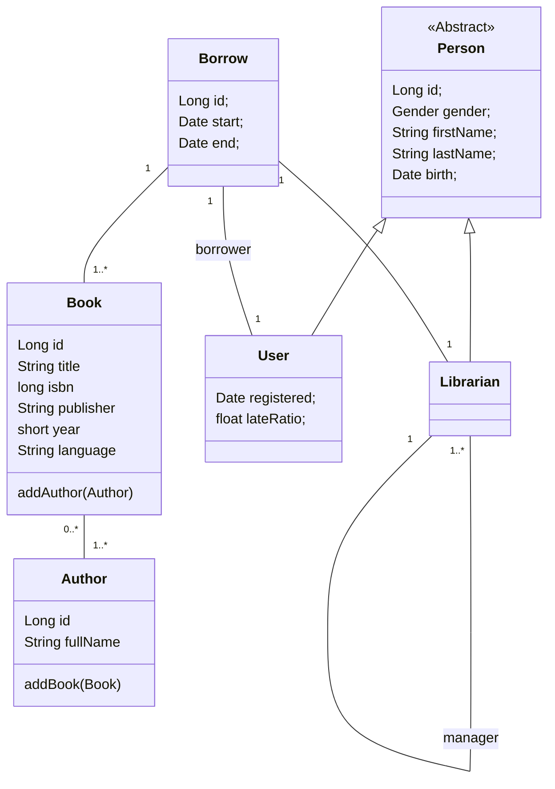

```mermaid
classDiagram
    Book "0..*" -- "1..*" Author
    Person <|-- User
    Person <|-- Librarian
    Librarian "1..*" -- "1" Librarian : manager
    Borrow "1" -- "1..*" Book
    Borrow "1" -- "1" User: borrower
    Borrow "1" -- "1" Librarian
    <<Abstract>> Person
    class Author {
        Long id
        String fullName  
        addBook(Book)      
    }
    class Book {
        Long id
        String title
        long isbn
        String publisher
        short year
        String language
        addAuthor(Author)
    }
    class Person {
        Long id;
        Gender gender;
        String firstName;
        String lastName;
        Date birth;
    }
    class Librarian {
        
    }
    class User {
        Date registered;
        float lateRatio;
    }
    class Borrow {
        Long id;
        Date start;
        Date end;
    }
```